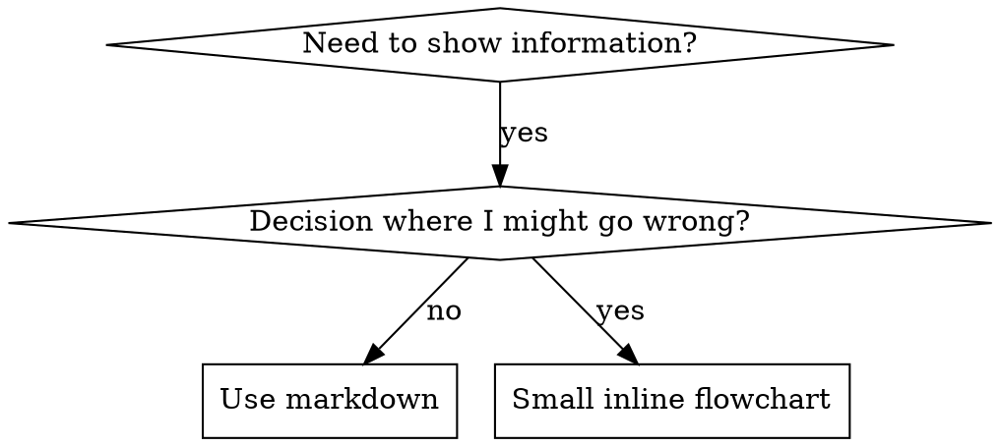

# Escribiendo Skills

## Descripción general

**Escribir skills ES Test-Driven Development aplicado a documentación de procesos.**

**Los skills personales viven en directorios específicos de cada agente (`~/.claude/skills` para Claude Code, `~/.agents/skills/` para Codex)**

Escribís casos de prueba (escenarios de presión con subagentes), los ves fallar (comportamiento base), escribís el skill (documentación), ves que las pruebas pasan (los agentes cumplen), y refactorizás (cerrás vacíos legales).

**Principio central:** Si no viste fallar a un agente sin el skill, no sabés si el skill enseña lo correcto.

**CONOCIMIENTO PREVIO REQUERIDO:** DEBÉS entender superpowers:test-driven-development antes de usar este skill. Ese skill define el ciclo fundamental RED-GREEN-REFACTOR. Este skill adapta TDD a la documentación.

**Guía oficial:** Para las mejores prácticas oficiales de Anthropic sobre la creación de skills, ver anthropic-best-practices.md. Este documento aporta patrones y lineamientos adicionales que complementan el enfoque basado en TDD de este skill.

## ¿Qué es un Skill?

Un **skill** es una guía de referencia para técnicas, patrones o herramientas probadas. Los skills ayudan a futuras instancias de Claude a encontrar y aplicar enfoques efectivos.

**Los skills son:** Técnicas reutilizables, patrones, herramientas, guías de referencia

**Los skills NO son:** Narrativas sobre cómo resolviste un problema una vez

## Mapeo de TDD para Skills

| Concepto TDD | Creación de Skills |
|-------------|----------------|
| **Caso de prueba** | Escenario de presión con subagente |
| **Código de producción** | Documento del skill (SKILL.md) |
| **La prueba falla (RED)** | El agente viola la regla sin el skill (línea base) |
| **La prueba pasa (GREEN)** | El agente cumple con el skill presente |
| **Refactor** | Cerrar vacíos legales manteniendo el cumplimiento |
| **Escribir la prueba primero** | Ejecutar el escenario base ANTES de escribir el skill |
| **Verla fallar** | Documentar las racionalizaciones exactas que usa el agente |
| **Código mínimo** | Escribir el skill abordando esas violaciones específicas |
| **Verla pasar** | Verificar que el agente ahora cumple |
| **Ciclo de refactor** | Encontrar nuevas racionalizaciones → taparlas → reverificar |

Todo el proceso de creación de skills sigue RED-GREEN-REFACTOR.

## Cuándo crear un Skill

**Creá uno cuando:**
- La técnica no te resultó intuitivamente obvia
- Volverías a consultar esto en distintos proyectos
- El patrón aplica de forma amplia (no es específico de un proyecto)
- Otros se beneficiarían

**No lo crees para:**
- Soluciones puntuales
- Prácticas estándar ya bien documentadas en otro lado
- Convenciones específicas del proyecto (ponelas en CLAUDE.md)
- Restricciones mecánicas (si se puede aplicar con regex/validación, automatizalo — reservá la documentación para las decisiones que requieren criterio)

## Tipos de Skill

### Técnica
Método concreto con pasos a seguir (condition-based-waiting, root-cause-tracing)

### Patrón
Forma de pensar sobre problemas (flatten-with-flags, test-invariants)

### Referencia
Documentación de API, guías de sintaxis, documentación de herramientas (office docs)

## Estructura de directorios


```
skills/
  skill-name/
    SKILL.md              # Main reference (required)
    supporting-file.*     # Only if needed
```

**Namespace plano** - todos los skills en un único namespace consultable

**Archivos separados para:**
1. **Referencia extensa** (100+ líneas) - documentación de API, sintaxis exhaustiva
2. **Herramientas reutilizables** - Scripts, utilidades, plantillas

**Mantené inline:**
- Principios y conceptos
- Patrones de código (< 50 líneas)
- Todo lo demás

## Estructura de SKILL.md

**Frontmatter (YAML):**
- Dos campos requeridos: `name` y `description` (ver [agentskills.io/specification](https://agentskills.io/specification) para todos los campos soportados)
- Máximo 1024 caracteres en total
- `name`: Usar solo letras, números y guiones (sin paréntesis ni caracteres especiales)
- `description`: En tercera persona, describe ÚNICAMENTE cuándo usarlo (NO qué hace)
  - Empezar con "Use when..." para enfocarse en las condiciones que lo disparan
  - Incluir síntomas, situaciones y contextos específicos
  - **NUNCA resumir el proceso o flujo de trabajo del skill** (ver la sección CSO para entender por qué)
  - Mantenerlo bajo 500 caracteres si es posible

```markdown
---
name: Skill-Name-With-Hyphens
description: Use when [condiciones y síntomas específicos que lo disparan]
---

# Nombre del Skill

## Overview
¿Qué es esto? Principio central en 1-2 oraciones.

## When to Use
[Pequeño flowchart inline SI la decisión no es obvia]

Lista con SÍNTOMAS y casos de uso
Cuándo NO usarlo

## Core Pattern (para técnicas/patrones)
Comparación de código antes/después

## Quick Reference
Tabla o lista para escanear operaciones comunes

## Implementation
Código inline para patrones simples
Enlace a archivo para referencia extensa o herramientas reutilizables

## Common Mistakes
Qué puede salir mal + soluciones

## Real-World Impact (opcional)
Resultados concretos
```


## Claude Search Optimization (CSO)

**Crítico para el descubrimiento:** las futuras instancias de Claude necesitan ENCONTRAR tu skill

### 1. Campo de descripción rico

**Propósito:** Claude lee la descripción para decidir qué skills cargar para una tarea determinada. Hacé que responda: "¿Debería leer este skill ahora mismo?"

**Formato:** Empezar con "Use when..." para enfocarse en las condiciones que lo disparan

**CRÍTICO: La descripción = Cuándo usarlo, NO Qué hace el skill**

La descripción debe describir ÚNICAMENTE las condiciones que lo disparan. NO resumas el proceso o flujo de trabajo del skill en la descripción.

**Por qué importa esto:** Las pruebas revelaron que cuando una descripción resume el flujo de trabajo del skill, Claude puede seguir la descripción en lugar de leer el contenido completo del skill. Una descripción que decía "code review between tasks" hizo que Claude hiciera UNA sola revisión, aun cuando el flowchart del skill mostraba claramente DOS revisiones (cumplimiento de la spec y luego calidad de código).

Cuando la descripción se cambió a simplemente "Use when executing implementation plans with independent tasks" (sin resumen del flujo de trabajo), Claude leyó correctamente el flowchart y siguió el proceso de revisión en dos etapas.

**La trampa:** Las descripciones que resumen el flujo de trabajo crean un atajo que Claude va a tomar. El cuerpo del skill se convierte en documentación que Claude se salta.

```yaml
# ❌ BAD: Summarizes workflow - Claude may follow this instead of reading skill
description: Use when executing plans - dispatches subagent per task with code review between tasks

# ❌ BAD: Too much process detail
description: Use for TDD - write test first, watch it fail, write minimal code, refactor

# ✅ GOOD: Just triggering conditions, no workflow summary
description: Use when executing implementation plans with independent tasks in the current session

# ✅ GOOD: Triggering conditions only
description: Use when implementing any feature or bugfix, before writing implementation code
```

**Contenido:**
- Usá disparadores, síntomas y situaciones concretas que señalen que este skill aplica
- Describí el *problema* (race conditions, comportamiento inconsistente) no *síntomas específicos de un lenguaje* (setTimeout, sleep)
- Mantené los disparadores agnósticos de tecnología a menos que el skill en sí sea específico de una tecnología
- Si el skill es específico de una tecnología, hacelo explícito en el disparador
- Escribí en tercera persona (se inyecta en el system prompt)
- **NUNCA resumas el proceso o flujo de trabajo del skill**

```yaml
# ❌ BAD: Too abstract, vague, doesn't include when to use
description: For async testing

# ❌ BAD: First person
description: I can help you with async tests when they're flaky

# ❌ BAD: Mentions technology but skill isn't specific to it
description: Use when tests use setTimeout/sleep and are flaky

# ✅ GOOD: Starts with "Use when", describes problem, no workflow
description: Use when tests have race conditions, timing dependencies, or pass/fail inconsistently

# ✅ GOOD: Technology-specific skill with explicit trigger
description: Use when using React Router and handling authentication redirects
```

### 2. Cobertura de palabras clave

Usá palabras que Claude buscaría:
- Mensajes de error: "Hook timed out", "ENOTEMPTY", "race condition"
- Síntomas: "flaky", "hanging", "zombie", "pollution"
- Sinónimos: "timeout/hang/freeze", "cleanup/teardown/afterEach"
- Herramientas: Comandos reales, nombres de librerías, tipos de archivo

### 3. Nomenclatura descriptiva

**Usá voz activa, verbo primero:**
- ✅ `creating-skills` no `skill-creation`
- ✅ `condition-based-waiting` no `async-test-helpers`

### 4. Eficiencia de tokens (Crítico)

**Problema:** los skills de getting-started y los consultados con frecuencia se cargan en CADA conversación. Cada token cuenta.

**Cantidad de palabras objetivo:**
- Flujos de getting-started: <150 palabras cada uno
- Skills cargados con frecuencia: <200 palabras en total
- Otros skills: <500 palabras (aun así sé conciso)

**Técnicas:**

**Mové los detalles a la ayuda de la herramienta:**
```bash
# ❌ BAD: Document all flags in SKILL.md
search-conversations supports --text, --both, --after DATE, --before DATE, --limit N

# ✅ GOOD: Reference --help
search-conversations supports multiple modes and filters. Run --help for details.
```

**Usá referencias cruzadas:**
```markdown
# ❌ BAD: Repeat workflow details
When searching, dispatch subagent with template...
[20 lines of repeated instructions]

# ✅ GOOD: Reference other skill
Always use subagents (50-100x context savings). REQUIRED: Use [other-skill-name] for workflow.
```

**Comprimí los ejemplos:**
```markdown
# ❌ BAD: Verbose example (42 words)
your human partner: "How did we handle authentication errors in React Router before?"
You: I'll search past conversations for React Router authentication patterns.
[Dispatch subagent with search query: "React Router authentication error handling 401"]

# ✅ GOOD: Minimal example (20 words)
Partner: "How did we handle auth errors in React Router?"
You: Searching...
[Dispatch subagent → synthesis]
```

**Eliminá la redundancia:**
- No repitas lo que ya está en skills referenciados de forma cruzada
- No expliques lo que es obvio a partir del comando
- No incluyas múltiples ejemplos del mismo patrón

**Verificación:**
```bash
wc -w skills/path/SKILL.md
# getting-started workflows: aim for <150 each
# Other frequently-loaded: aim for <200 total
```

**Nombralo según lo que HACÉS o la idea central:**
- ✅ `condition-based-waiting` > `async-test-helpers`
- ✅ `using-skills` no `skill-usage`
- ✅ `flatten-with-flags` > `data-structure-refactoring`
- ✅ `root-cause-tracing` > `debugging-techniques`

**Los gerundios (-ing) funcionan bien para procesos:**
- `creating-skills`, `testing-skills`, `debugging-with-logs`
- Activo, describe la acción que estás tomando

### 4. Referenciar otros skills de forma cruzada

**Al escribir documentación que referencia otros skills:**

Usá solo el nombre del skill, con marcadores explícitos de requisito:
- ✅ Bien: `**REQUIRED SUB-SKILL:** Use superpowers:test-driven-development`
- ✅ Bien: `**REQUIRED BACKGROUND:** You MUST understand superpowers:systematic-debugging`
- ❌ Mal: `See skills/testing/test-driven-development` (no queda claro si es requerido)
- ❌ Mal: `@skills/testing/test-driven-development/SKILL.md` (fuerza la carga, consume contexto)

**Por qué no usar enlaces con @:** la sintaxis `@` fuerza la carga inmediata de archivos, consumiendo 200k+ tokens de contexto antes de que los necesites.

## Uso de flowcharts



**Usá flowcharts SOLO para:**
- Puntos de decisión no obvios
- Bucles de proceso donde podrías detenerte demasiado pronto
- Decisiones de "cuándo usar A vs B"

**Nunca uses flowcharts para:**
- Material de referencia → Tablas, listas
- Ejemplos de código → Bloques markdown
- Instrucciones lineales → Listas numeradas
- Etiquetas sin significado semántico (step1, helper2)

Ver @graphviz-conventions.dot para las reglas de estilo de graphviz.

**Para visualizar junto a tu compañero humano:** Usá `render-graphs.js` en este directorio para renderizar los flowcharts de un skill a SVG:
```bash
./render-graphs.js ../some-skill           # Each diagram separately
./render-graphs.js ../some-skill --combine # All diagrams in one SVG
```

## Ejemplos de código

**Un ejemplo excelente supera a muchos mediocres**

Elegí el lenguaje más relevante:
- Técnicas de testing → TypeScript/JavaScript
- Debugging de sistemas → Shell/Python
- Procesamiento de datos → Python

**Un buen ejemplo:**
- Es completo y ejecutable
- Está bien comentado explicando el POR QUÉ
- Proviene de un escenario real
- Muestra el patrón con claridad
- Está listo para adaptar (no es una plantilla genérica)

**No hagas esto:**
- Implementar en 5+ lenguajes
- Crear plantillas para completar espacios en blanco
- Escribir ejemplos artificiales

Sos bueno portando código - un gran ejemplo es suficiente.

## Organización de archivos

### Skill autocontenido
```
defense-in-depth/
  SKILL.md    # Everything inline
```
Cuándo: Todo el contenido entra, no se necesita referencia extensa

### Skill con herramienta reutilizable
```
condition-based-waiting/
  SKILL.md    # Overview + patterns
  example.ts  # Working helpers to adapt
```
Cuándo: La herramienta es código reutilizable, no solo narrativa

### Skill con referencia extensa
```
pptx/
  SKILL.md       # Overview + workflows
  pptxgenjs.md   # 600 lines API reference
  ooxml.md       # 500 lines XML structure
  scripts/       # Executable tools
```
Cuándo: El material de referencia es demasiado extenso para ir inline

## La Ley de Hierro (igual que en TDD)

```
NO SKILL WITHOUT A FAILING TEST FIRST
```

Esto aplica tanto a skills NUEVOS como a EDICIONES de skills existentes.

¿Escribiste el skill antes de probarlo? Borralo. Empezá de nuevo.
¿Editaste el skill sin probarlo? Misma violación.

**Sin excepciones:**
- No para "adiciones simples"
- No para "solo agregar una sección"
- No para "actualizaciones de documentación"
- No guardes cambios sin probar como "referencia"
- No "adaptes" mientras corrés las pruebas
- Borrar significa borrar

**CONOCIMIENTO PREVIO REQUERIDO:** El skill superpowers:test-driven-development explica por qué esto importa. Los mismos principios aplican a la documentación.

## Probar todos los tipos de Skill

Distintos tipos de skill necesitan distintos enfoques de prueba:

### Skills que imponen disciplina (reglas/requisitos)

**Ejemplos:** TDD, verification-before-completion, designing-before-coding

**Probar con:**
- Preguntas académicas: ¿Entienden las reglas?
- Escenarios de presión: ¿Cumplen bajo estrés?
- Múltiples presiones combinadas: tiempo + costo hundido + agotamiento
- Identificar racionalizaciones y agregar contramedidas explícitas

**Criterio de éxito:** El agente sigue la regla bajo presión máxima

### Skills de técnica (guías de cómo hacer algo)

**Ejemplos:** condition-based-waiting, root-cause-tracing, defensive-programming

**Probar con:**
- Escenarios de aplicación: ¿Pueden aplicar la técnica correctamente?
- Escenarios de variación: ¿Manejan los casos límite?
- Pruebas de información faltante: ¿Las instrucciones tienen vacíos?

**Criterio de éxito:** El agente aplica exitosamente la técnica a un escenario nuevo

### Skills de patrón (modelos mentales)

**Ejemplos:** reducing-complexity, information-hiding concepts

**Probar con:**
- Escenarios de reconocimiento: ¿Reconocen cuándo aplica el patrón?
- Escenarios de aplicación: ¿Pueden usar el modelo mental?
- Contraejemplos: ¿Saben cuándo NO aplicarlo?

**Criterio de éxito:** El agente identifica correctamente cuándo/cómo aplicar el patrón

### Skills de referencia (documentación/APIs)

**Ejemplos:** documentación de API, referencias de comandos, guías de librerías

**Probar con:**
- Escenarios de recuperación: ¿Pueden encontrar la información correcta?
- Escenarios de aplicación: ¿Pueden usar correctamente lo que encontraron?
- Prueba de vacíos: ¿Están cubiertos los casos de uso comunes?

**Criterio de éxito:** El agente encuentra y aplica correctamente la información de referencia

## Racionalizaciones comunes para saltearse las pruebas

| Excusa | Realidad |
|--------|---------|
| "El skill es obviamente claro" | Claro para vos ≠ claro para otros agentes. Probalo. |
| "Es solo una referencia" | Las referencias pueden tener vacíos, secciones poco claras. Probá la recuperación. |
| "Probar es excesivo" | Los skills no probados tienen problemas. Siempre. 15 min de pruebas ahorran horas. |
| "Voy a probar si surgen problemas" | Problemas = los agentes no pueden usar el skill. Probá ANTES de desplegar. |
| "Es muy tedioso probar" | Probar es menos tedioso que depurar un mal skill en producción. |
| "Confío en que está bien" | El exceso de confianza garantiza problemas. Probá de todos modos. |
| "Con la revisión académica alcanza" | Leer ≠ usar. Probá escenarios de aplicación. |
| "No hay tiempo para probar" | Desplegar un skill sin probar desperdicia más tiempo arreglándolo después. |

**Todo esto significa: Probá antes de desplegar. Sin excepciones.**

## Blindar los Skills contra la racionalización

Los skills que imponen disciplina (como TDD) necesitan resistir la racionalización. Los agentes son inteligentes y encontrarán vacíos legales bajo presión.

**Nota de psicología:** Entender POR QUÉ funcionan las técnicas de persuasión te ayuda a aplicarlas de forma sistemática. Ver persuasion-principles.md para el fundamento de investigación (Cialdini, 2021; Meincke et al., 2025) sobre los principios de autoridad, compromiso, escasez, prueba social y unidad.

### Cerrá cada vacío legal de forma explícita

No te limites a enunciar la regla - prohibí las alternativas específicas:

<Bad>
```markdown
Write code before test? Delete it.
```
</Bad>

<Good>
```markdown
Write code before test? Delete it. Start over.

**No exceptions:**
- Don't keep it as "reference"
- Don't "adapt" it while writing tests
- Don't look at it
- Delete means delete
```
</Good>

### Abordá los argumentos de "espíritu vs. letra"

Agregá un principio fundacional temprano:

```markdown
**Violating the letter of the rules is violating the spirit of the rules.**
```

Esto corta de raíz toda una clase de racionalizaciones del tipo "estoy siguiendo el espíritu".

### Construí una tabla de racionalizaciones

Capturá las racionalizaciones de las pruebas base (ver la sección de Testing más abajo). Cada excusa que ponga un agente va en la tabla:

```markdown
| Excuse | Reality |
|--------|---------|
| "Too simple to test" | Simple code breaks. Test takes 30 seconds. |
| "I'll test after" | Tests passing immediately prove nothing. |
| "Tests after achieve same goals" | Tests-after = "what does this do?" Tests-first = "what should this do?" |
```

### Creá una lista de señales de alerta

Hacé que sea fácil para los agentes autoevaluarse cuando están racionalizando:

```markdown
## Red Flags - STOP and Start Over

- Code before test
- "I already manually tested it"
- "Tests after achieve the same purpose"
- "It's about spirit not ritual"
- "This is different because..."

**All of these mean: Delete code. Start over with TDD.**
```

### Actualizá el CSO con síntomas de violación

Agregá a la descripción: síntomas de cuando estás A PUNTO de violar la regla:

```yaml
description: use when implementing any feature or bugfix, before writing implementation code
```

## RED-GREEN-REFACTOR para Skills

Seguí el ciclo de TDD:

### RED: Escribir la prueba que falla (línea base)

Ejecutá el escenario de presión con un subagente SIN el skill. Documentá el comportamiento exacto:
- ¿Qué decisiones tomó?
- ¿Qué racionalizaciones usó (textuales)?
- ¿Qué presiones provocaron las violaciones?

Esto es "ver fallar la prueba" - tenés que ver qué hacen los agentes naturalmente antes de escribir el skill.

### GREEN: Escribir el skill mínimo

Escribí el skill que aborde esas racionalizaciones específicas. No agregues contenido extra para casos hipotéticos.

Ejecutá los mismos escenarios CON el skill. El agente ahora debería cumplir.

### REFACTOR: Cerrar vacíos legales

¿El agente encontró una nueva racionalización? Agregá una contramedida explícita. Volvé a probar hasta que sea infalible.

**Metodología de pruebas:** Ver @testing-skills-with-subagents.md para la metodología de pruebas completa:
- Cómo escribir escenarios de presión
- Tipos de presión (tiempo, costo hundido, autoridad, agotamiento)
- Tapar vacíos de forma sistemática
- Técnicas de meta-testing

## Antipatrones

### ❌ Ejemplo narrativo
"In session 2025-10-03, we found empty projectDir caused..."
**Por qué está mal:** Demasiado específico, no reutilizable

### ❌ Dilución multi-lenguaje
example-js.js, example-py.py, example-go.go
**Por qué está mal:** Calidad mediocre, carga de mantenimiento

### ❌ Código en flowcharts
```dot
step1 [label="import fs"];
step2 [label="read file"];
```
**Por qué está mal:** No se puede copiar y pegar, difícil de leer

### ❌ Etiquetas genéricas
helper1, helper2, step3, pattern4
**Por qué está mal:** Las etiquetas deberían tener significado semántico

## DETENÉTE: Antes de pasar al siguiente Skill

**Después de escribir CUALQUIER skill, DEBÉS DETENERTE y completar el proceso de despliegue.**

**NO hagas esto:**
- Crear varios skills en lote sin probar cada uno
- Pasar al siguiente skill antes de que el actual esté verificado
- Saltear las pruebas porque "hacerlo en lote es más eficiente"

**La checklist de despliegue de abajo es OBLIGATORIA para CADA skill.**

Desplegar skills sin probar = desplegar código sin probar. Es una violación de los estándares de calidad.

## Checklist de creación de Skills (adaptada de TDD)

**IMPORTANTE: Usá TodoWrite para crear tareas por CADA ítem de la checklist de abajo.**

**Fase RED - Escribir la prueba que falla:**
- [ ] Crear escenarios de presión (3+ presiones combinadas para skills de disciplina)
- [ ] Ejecutar escenarios SIN el skill - documentar el comportamiento base de forma textual
- [ ] Identificar patrones en las racionalizaciones/fallas

**Fase GREEN - Escribir el skill mínimo:**
- [ ] El nombre usa solo letras, números y guiones (sin paréntesis/caracteres especiales)
- [ ] Frontmatter YAML con los campos requeridos `name` y `description` (máx 1024 caracteres; ver [spec](https://agentskills.io/specification))
- [ ] La descripción empieza con "Use when..." e incluye disparadores/síntomas específicos
- [ ] La descripción está escrita en tercera persona
- [ ] Palabras clave a lo largo del texto para la búsqueda (errores, síntomas, herramientas)
- [ ] Overview claro con el principio central
- [ ] Aborda las fallas base específicas identificadas en RED
- [ ] Código inline O enlace a un archivo separado
- [ ] Un ejemplo excelente (no multi-lenguaje)
- [ ] Ejecutar escenarios CON el skill - verificar que los agentes ahora cumplan

**Fase REFACTOR - Cerrar vacíos legales:**
- [ ] Identificar NUEVAS racionalizaciones de las pruebas
- [ ] Agregar contramedidas explícitas (si es un skill de disciplina)
- [ ] Construir la tabla de racionalizaciones a partir de todas las iteraciones de prueba
- [ ] Crear la lista de señales de alerta
- [ ] Volver a probar hasta que sea infalible

**Controles de calidad:**
- [ ] Flowchart pequeño solo si la decisión no es obvia
- [ ] Tabla de referencia rápida
- [ ] Sección de errores comunes
- [ ] Sin narrativa tipo cuento
- [ ] Archivos de soporte solo para herramientas o referencia extensa

**Despliegue:**
- [ ] Commitear el skill a git y pushearlo a tu fork (si está configurado)
- [ ] Considerar contribuirlo de vuelta vía PR (si es de utilidad amplia)

## Flujo de descubrimiento

Cómo una futura instancia de Claude encuentra tu skill:

1. **Encuentra un problema** ("tests are flaky")
3. **Encuentra el SKILL** (la descripción coincide)
4. **Escanea el overview** (¿es esto relevante?)
5. **Lee los patrones** (tabla de referencia rápida)
6. **Carga el ejemplo** (solo al implementar)

**Optimizá para este flujo** - poné los términos buscables temprano y con frecuencia.

## En resumen

**Crear skills ES TDD para documentación de procesos.**

Misma Ley de Hierro: ningún skill sin una prueba que falle primero.
Mismo ciclo: RED (línea base) → GREEN (escribir el skill) → REFACTOR (cerrar vacíos legales).
Mismos beneficios: Mejor calidad, menos sorpresas, resultados infalibles.

Si seguís TDD para código, seguilo para skills. Es la misma disciplina aplicada a la documentación.
